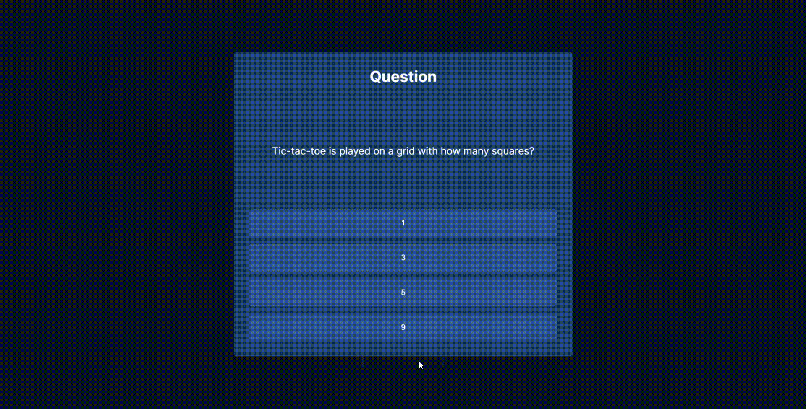

# **Tic Tac Toe**
This is a tic-tac-toe game with a *twist*. Check it [here.](https://tictactoe-ruddy.vercel.app/)

## How to play
1. The game is played on a grid that's 3 squares by 3 squares.
2. You are X, player 2 (computer) is O. Players take turns putting their marks in empty squares.
3. You need to answer a question before putting your mark. Wrong answer means skipping a turn.
4. The first player to get 3 of her marks in a row (up, down, across, or diagonally) is the winner.
6. When all 9 squares are full, the game is over.

## Technology
- HTML
- CSS
- Javascript